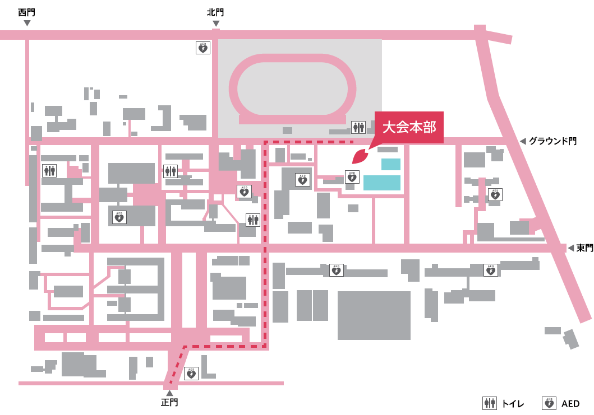

# 第１８回小金井アクアスロン大会  
 * 2016.8.21（日）
 * ボランティアマニュアル(Volunteer manual)

---
## 大会前日  
### トランジションバッグの袋詰め  
### テントなどの連合備品の搬入  
### 大学キャンパス内の清掃  
### プール設備の前日確認  

---
## 大会当日  

### 【受付・集合・召集・スタートの時刻】
||親子ペア|Ｃタイプ|Ｂタイプ|Ａタイプ|
|---|---|---|---|---|
|受付|８：３０～９：００|<-|<-|<-|
|トランジションのセッティング|８：３０～９：２０|<-|<-|<-|
|集合|９：２０|<-|<-|<-|
|開会式・競技説明|９：２０～９：４５|<-|<-|<-|
|召集|９：４５～　|１０：１５～|１０：３０～|第１ウェーブ １１：００ 第２ウェーブ １１：１５ 第３ウェーブ １１：３０ 第４ウェーブ １１：４５|
|スタート|低学年 １０：００ 高学年 １０：１５|１０：３０|１０：４５|第１ウェーブ １１：１５ 第２ウェーブ １１：３０ 第３ウェーブ １１：４５ 第４ウェーブ １２：００|  

---
## 大会終了後  
### プールの鍵の返却  
### 関係者への報告、御礼  
### 各種報告書の作成  

---
## 構内図など  

---
## 各種関連資料について  
   * PDFダウンロードに失敗した場合、数秒おいてから再読み込みを行うことで成功するケースがある。

|資料名|PDF版ダウンロード(PC環境の方向き)|
|---|---|
|[スタッフ名簿](./2016Stafflist.md "スタッフ名簿を参照する")|[スタッフ名簿PDF版](https://gitprint.com/KoganeiTriathlon/KoganeiAquathlon/blob/master/Volunteer/2016Stafflist.md "スタッフ名簿PDF版を参照する")|
|[スタートリスト](../CompetitionGuidelines/2016_Startlist.md "使用資機材一覧を参照する")|[スタートリストPDF版](https://gitprint.com/KoganeiTriathlon/KoganeiAquathlon/blob/master/CompetitionGuidelines/2016_Startlist.md "スタートリストPDF版を参照する")|
|[使用資機材一覧](./2016Itemlist.md "使用資機材一覧を参照する")|[使用資機材一覧PDF版](https://gitprint.com/KoganeiTriathlon/KoganeiAquathlon/blob/master/Volunteer/2016Itemlist.md "使用資機材一覧PDF版を参照する")|
|[作業一覧](./2016worklist.md "作業一覧を参照する")|[作業一覧PDF版](https://gitprint.com/KoganeiTriathlon/KoganeiAquathlon/blob/master/Volunteer/2016worklist.md "作業一覧PDF版を参照する")|

